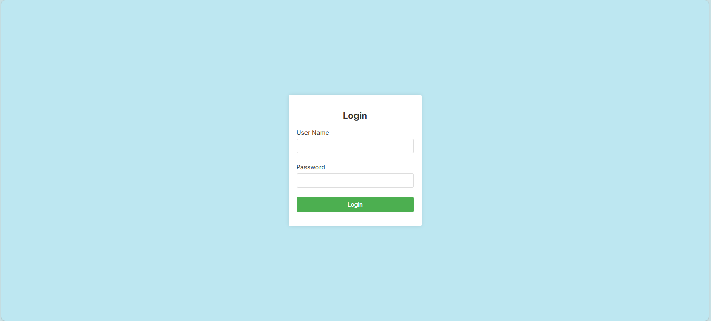
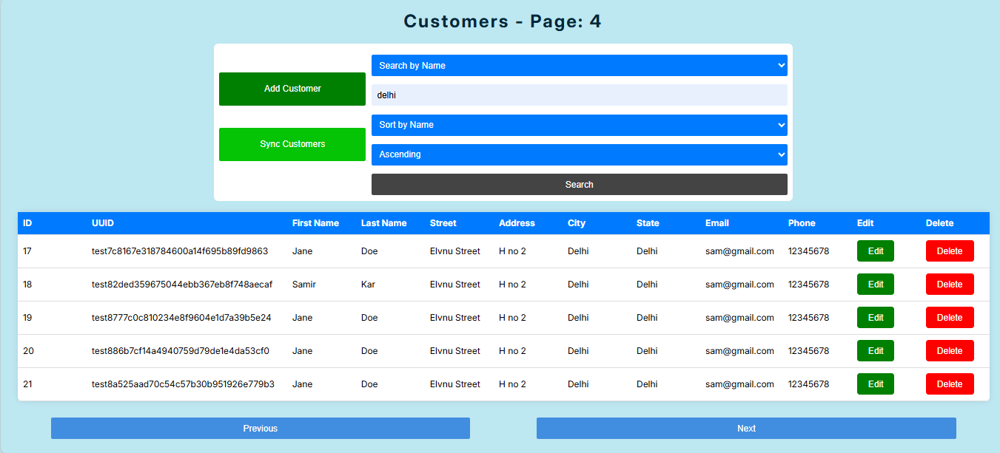
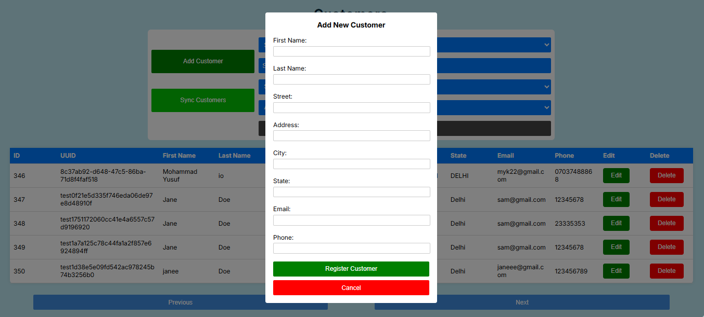

# SunBase Assignment Backend  

This project includes the code for managing customer information through an API. The main goal is to create functionality for adding, viewing, updating, and deleting customer data (CRUD operations). Later, the focus will shift to synchronizing this customer data with an external API to keep it consistent and accurate across systems.

## All APIs are mentioned below and API json file is also attached with Backend repository.

### First Part

0. **Create User**
   - Path: `http://localhost:8080/auth/addNewUser`
   - Method: POST
   - Body: {
                "password" : "123",
                "email" : "Yusuf@gmail.com"
            }
   - Description: Creates a new user in the system.

1. **Login User**
   - Path: `http://localhost:8080/auth/generateToken`
   - Method: POST
   - Body: {
                "password" : "123",
                "username" : "Yusuf@gmail.com"
            }
   - Description: Logs in a User, if credentials are matched. And returns a Jwt Token for further Api calls.
   - Response: Jwt Token.

2. **Create Customer**
   - Path: `http://localhost:8080/customer/create`
   - Method: POST
   - Authorization: [Jwt Token]
   - Body: {
            "first_name": "Yusuf", 
            "last_name": "Khan", 
            "street": "Elvnu Street", 
            "address": "H no 2 ",
            "city": "",
            "state": "Delhi",
            "email": "yusuf@gmail.com", 
            "phone": "12345678"
            }
   - Description: Creates a new customer in the database and returns the record with Id.

3. **Update Customer**
   - Path: `http://localhost:8080/customer/update/id/{id}`
   - Method: PUT
   - Authorization: [Jwt Token]
   - Body: {
            "first_name": "Mohammad Yusuf", 
            "last_name": "Khan", 
            "street": "Elvnu Street", 
            "address": "H no 2 ",
            "city": "",
            "state": "Delhi",
            "email": "yusufKhan@gmail.com", 
            "phone": "12345678"
            }
   - Description: Updates an existing customer in the database and returns the record with Id.

4. **Get a Customer Based on ID**
   - Path: `http://localhost:8080/customer/get/id/{id}`
   - Method: GET
   - Authorization: [Jwt Token]
   - Description: Returns a customer with its details.

5. **Delete a Customer**
   - Path: `http://localhost:8080/customer/delete/id/{id}`
   - Method: DELETE
   - Authorization: [Jwt Token]
   - Description: Delete a customer from database with the given id.
  
6. **Get List of Customers** 
   - Path: `http://localhost:8080/customer/get/list-of-customers`
   - Method: GET
   - Authorization: [Jwt Token]
   - Description: Gets a paginated, sorted, and searchable list of customers.
  
- ( **Login Page**)

- (**Customers Page**)

- (**Add Customer Page**)

### Second Part

In the second part, Synchronize feature is added:

- **Synchronize List**
  - Description: A "Sync" button is added on the customer list page. 
    By hitting this button it will trigger a call to first get a 'token' from SunBase API,
    then using that token, it will get the customers list. (Getting Token and making customers data (from SunBase) calls are being made at backend level)
    The retrieved customers are then saved in the database. 
    If a customer already exists in the database, its information is updated instead of inserting a new record. 
    
  - This sync functionality will be done by 2 API calls as follows :

7. ***Token from SunBase***
   - Path: `http://localhost:8080/customer/get/token/sunbase`
   - Method: POST
   - Authorization: [Jwt Token]
   - Body: {
           "login_id" : "test@sunbasedata.com", "password" :"Test@123"
           }
   - Description: Gets User logIn in the Sunbase database, sets Token in Spring application and returns the token.
   - Response: dGVzdEBzdW5iYXNlZGF0YS5jb206VGVzdEAxMjM=
   ****Note : Without calling this Api, the 2nd one will not work becuase it requires token in that call which is being set during 1st Api call.(other wise you can hardcode it in 'tokenFromSunbase' variable)****

8. ***Get Customers from SunBase***
   - Path: `http://localhost:8080/customer/get/customers/sunbase`
   - Method: GET
   - Authorization: [Jwt Token]
   - Description: Gets Users list from the Sunbase database and saves or updates records in local database.
   - Response: List of Customers.

### How to run ? 

- Clone both Frontend and Backend repositories.
- Set up Application properties in **application.properties** file.
- Run both the backend and frontend projects.